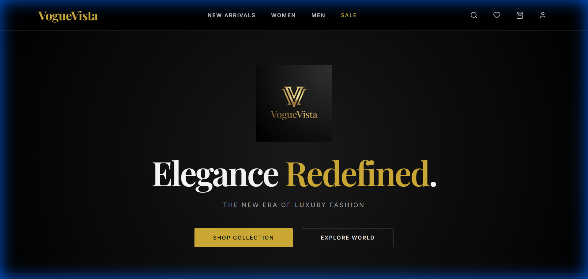
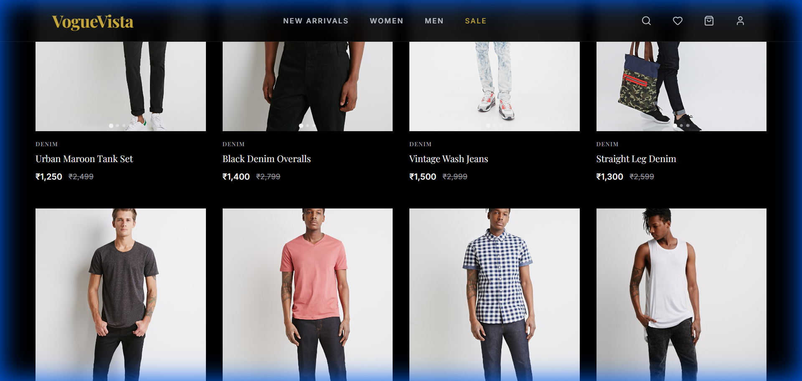
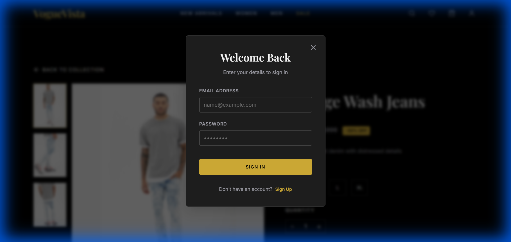
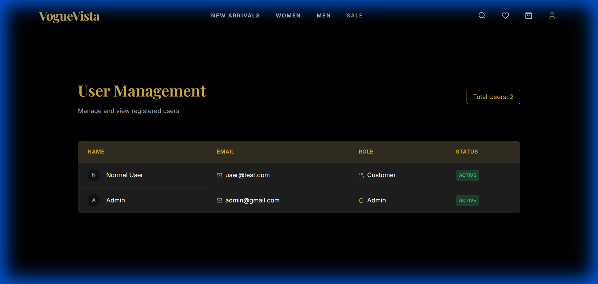

# VogueVista 🌟

**VogueVista** is a modern, luxury fashion e-commerce application built with React and Vite. It features a sleek, dark-themed UI with advanced functionality including real-time search, user authentication, and a responsive design.

## 🚀 Features

*   **Luxury Aesthetics**: A premium dark-themed design with smooth animations and glassmorphism effects.
*   **Dynamic Product Search**: Real-time filtering of products by name, description, and category.
*   **User Authentication**:
    *   **Login & Signup**: Securely handle user access with `localStorage` persistence.
    *   **Guest vs. Registered Views**: Context-aware profile menus (Logout for users, Login for guests).
*   **Admin Dashboard**:
    *   **User Management**: View registered users (Development Tool).
*   **Responsive Navigation**: Optimized for both desktop and mobile devices.
*   **Interactive UI**:
    *   Expandable search bar.
    *   Hover effects on product cards.
    *   Modal-based authentication.

## 🛠️ Tech Stack

*   **Frontend**: React.js, Vite
*   **Styling**: Vanilla CSS (Custom properties, animations), Lucide React (Icons)
*   **State Management**: React Hooks (`useState`, `useEffect`, `useRef`)
*   **Persistence**: Browser `localStorage`

## 📸 Screenshots

### Home Page


### Product Catalog (Search & Filtering)


### Product Details


### Authentication (Login/Signup)


### Admin Dashboard (User Management)


## 📦 Installation & Setup

1.  **Clone the repository**:
    ```bash
    git clone https://github.com/ashishmishra3648/VogueVista.git
    cd VogueVista
    ```

2.  **Install dependencies**:
    ```bash
    npm install
    ```

3.  **Run the development server**:
    ```bash
    npm run dev
    ```

4.  **Open in Browser**:
    Navigate to `http://localhost:5173` to view the application.

## ⚠️ Note on Images

To reduce repository size, the high-resolution image dataset (`public/images/`) is **excluded** from this repository.
*   The application will run, but product images may use placeholders or fail to load without the local dataset.
*   To restore full visuals, please ensure you have the `public/images` directory populated with the required assets.

## 🤝 Contributing

Contributions, issues, and feature requests are welcome!

---
*Developed by Ashish Mishra*
